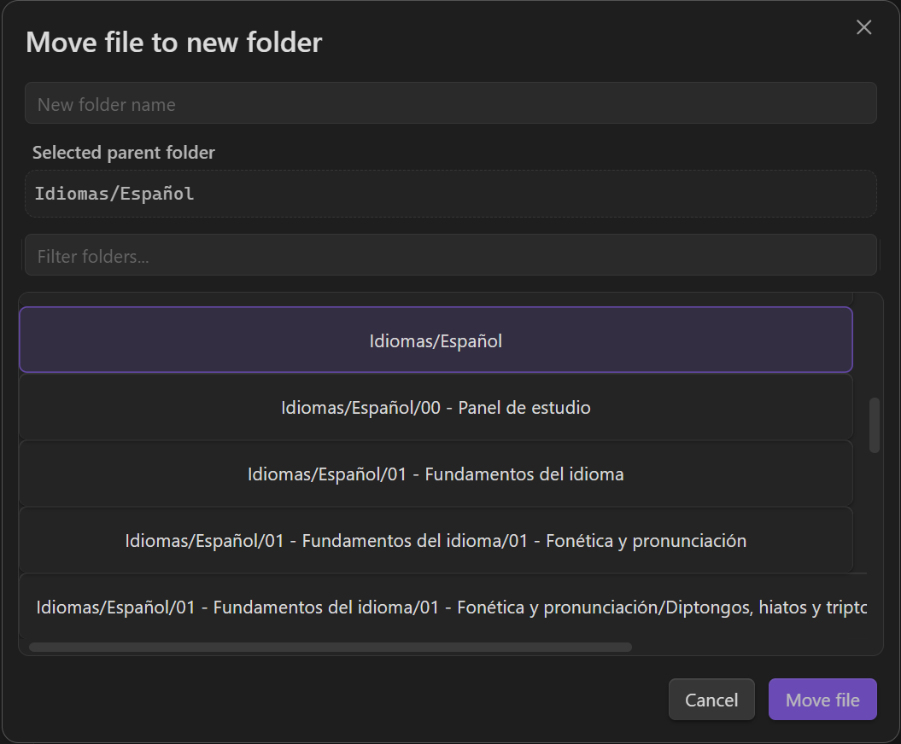

# Move to New Folder

`Move to New Folder` is an Obsidian [community plugin](https://community.obsidian.md/plugins/move-to-new-folder) that moves a file or folder into a newly created folder without requiring you to type the full destination path.

## Installation

### From Community plugins

Install from Obsidian's Community plugins directory:

1. Open **Settings** in Obsidian
2. Go to **Community plugins** and choose **Browse**
3. Search for **Move to New Folder**
4. Select **Install**, then **Enable**

You can also open the listing directly: <https://community.obsidian.md/plugins/move-to-new-folder>

Advanced install options

### Manual install from GitHub release

If you cannot use Community plugins, install the latest GitHub release manually:

1. Download `manifest.json`, `main.js`, and `styles.css` from the latest release
2. Create the folder `.obsidian/plugins/move-to-new-folder/` in your vault if it does not already exist
3. Copy the downloaded files into that folder
4. Enable **Move to New Folder** in Obsidian

### BRAT beta testing

Use BRAT only if you intentionally want to test unreleased changes from this repository. Community plugins is the recommended install path for normal use.

## What it does

- Adds `Move file to new folder...` for notes
- Adds `Move folder to new folder...` in the file explorer for folders
- Lets you choose a parent folder from a searchable picker
- Creates the new child folder and moves the target safely with Obsidian APIs
- Preserves Obsidian's normal link-update behavior when moving files

## Preview

## How to use it

### File explorer

1. Right-click a note or folder
2. Choose `Move file to new folder...` or `Move folder to new folder...`
3. Pick the parent folder
4. Enter the new folder name
5. Confirm the move

### Command palette

1. Open a note
2. Run `Move file to new folder...`
3. Complete the same modal flow

Folder moves are supported from the file explorer context menu.

## Settings

- **Default parent to current note folder**: start the picker from the active note's parent instead of vault root

## Platform support

- Designed for desktop and mobile
- Tested on Windows, Android, and Linux
- macOS and iOS have not been fully validated yet

## Privacy and external services

- No telemetry
- No analytics
- No network access
- No account requirement
- No payments or subscriptions
- No external service dependencies at runtime

## Docs

- [Use cases](docs/use-cases.md)
- [FAQ](docs/faq.md)
